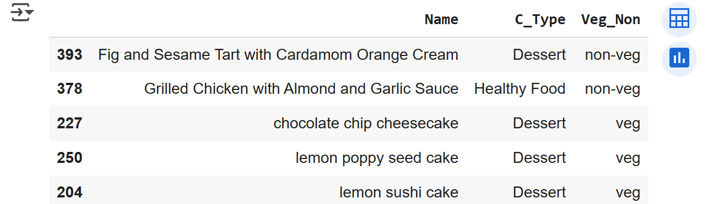
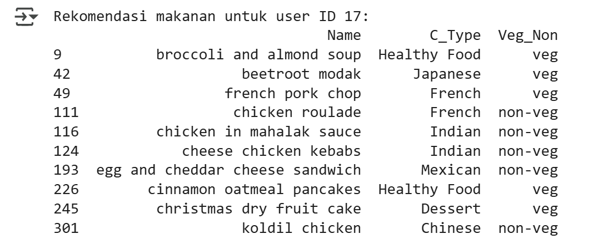

# Laporan Proyek Machine Learning - Aksamala Citrayuh Anasita
**Sistem Rekomendasi Makanan**

## Project Overview

Dalam era digital saat ini, konsumen menghadapi begitu banyak pilihan makanan dari berbagai restoran dan platform layanan pengantaran makanan. Hal ini menimbulkan tantangan dalam menemukan makanan yang sesuai dengan preferensi dan kebutuhan individu secara cepat dan efektif. Sistem rekomendasi makanan menjadi solusi penting untuk membantu pengguna dalam memilih makanan yang sesuai dengan selera, kebiasaan makan, dan kebutuhan nutrisi mereka.

Proyek ini bertujuan untuk mengembangkan sistem rekomendasi makanan menggunakan dataset Food Recommendation System dari Kaggle, yang berisi data terkait preferensi makanan, jenis hidangan, dan atribut lain yang relevan. Sistem ini diharapkan dapat meningkatkan pengalaman pengguna dalam memilih makanan dengan memberikan rekomendasi yang personal dan akurat. Selain itu, solusi ini dapat membantu pelaku bisnis kuliner meningkatkan loyalitas pelanggan melalui layanan yang lebih personal dan berbasis data.

Pentingnya penyelesaian masalah ini didukung oleh riset yang menunjukkan bahwa sistem rekomendasi memainkan peranan vital dalam berbagai bidang e-commerce dan layanan daring, termasuk makanan (Ricci et al., 2015). Studi juga menegaskan bahwa personalisasi melalui algoritma rekomendasi dapat meningkatkan tingkat kepuasan dan keterlibatan pengguna secara signifikan (Adomavicius & Tuzhilin, 2005). Oleh karena itu, penerapan metode machine learning dan analisis data yang tepat dalam konteks sistem rekomendasi makanan sangat penting untuk menghadirkan solusi yang efektif dan bermanfaat.

**Referensi:**
- [APA] (-	F. Ricci, L. Rokach, and B. Shapira, Recommender Systems Handbook, 2nd ed. Springer, 2015.)
- [APA] (-	G. Adomavicius and A. Tuzhilin, "Toward the next generation of recommender systems: A survey of the state-of-the-art and possible extensions," IEEE Transactions on Knowledge and Data Engineering, vol. 17, no. 6, pp. 734–749, Jun. 2005.)

## Business Understanding

Pada tahap ini, dilakukan klarifikasi dan pemahaman terhadap masalah bisnis yang ingin diselesaikan dengan menggunakan data sistem rekomendasi makanan. Tujuan utama adalah membantu pengguna menemukan makanan yang sesuai preferensi mereka berdasarkan rating dan deskripsi makanan yang tersedia.

### Problem Statements
1.	Pengguna sering kesulitan menemukan makanan yang sesuai dengan preferensi mereka di tengah banyaknya pilihan. Tanpa sistem rekomendasi, pengguna perlu mencoba satu per satu makanan secara manual, yang tidak efisien dan mengurangi pengalaman pengguna.
2.	Data interaksi pengguna dengan makanan, berupa rating, masih terbatas dan tidak merata, sehingga menyulitkan sistem dalam memberikan rekomendasi yang akurat, terutama untuk pengguna baru atau makanan yang belum banyak dinilai.

### Goals

1.	Membangun sistem rekomendasi makanan yang dapat memberikan rekomendasi makanan sesuai preferensi pengguna berdasarkan karakteristik makanan dan riwayat interaksi pengguna, sehingga pengguna lebih mudah menemukan makanan yang mereka sukai.    
2.	Meningkatkan kualitas dan cakupan rekomendasi dengan mengimplementasikan metode rekomendasi hybrid (content-based filtering dan collaborative filtering) agar mampu mengatasi keterbatasan data rating dan memberikan rekomendasi yang relevan untuk semua pengguna, termasuk pengguna baru.

    ### Solution statements
    Dalam mengembangkan sistem rekomendasi makanan, terdapat beberapa pendekatan yang dapat digunakan untuk menghasilkan rekomendasi yang efektif berdasarkan preferensi pengguna dan karakteristik item. Berikut adalah dua pendekatan utama yang dapat diterapkan: **Content-Based Filtering** dan **Collaborative Filtering**.    

    1. **Content-Based Filtering (Penyaringan Berbasis Konten)**
    
    Content-based filtering merekomendasikan item kepada pengguna berdasarkan fitur dari item itu sendiri. Pendekatan ini menganalisis atribut dari makanan (misalnya jenis masakan, kategori veg/non-veg, deskripsi bahan) untuk menemukan kesamaan antar item. Sistem merekomendasikan item yang mirip dengan yang telah disukai oleh pengguna sebelumnya.  

    **Langkah Implementasi:**
    - **Ekstraksi Fitur**: Gabungkan fitur relevan dari makanan seperti C_Type, Veg_Non, dan Describe menjadi satu string untuk setiap item.
    - **Vektorisasi**: Gunakan teknik seperti TF-IDF untuk mengubah data teks menjadi vektor numerik.
    - **Perhitungan Similaritas**: Hitung cosine similarity antar vektor TF-IDF untuk mengukur kemiripan item.
    - **Generasi Rekomendasi**: Untuk makanan tertentu, ambil N item teratas yang paling mirip berdasarkan skor similarity. 

    **Kelebihan:**
    - Rekomendasi yang dipersonalisasi berdasarkan preferensi sebelumnya.
    - Tidak memerlukan data interaksi pengguna yang banyak dan cocok untuk item baru.

    **Kekurangan:**
    - •	Terbatas pada merekomendasikan item yang mirip dengan item yang sudah pernah dikonsumsi pengguna.
    - Membutuhkan data deskripsi item yang lengkap.    

    2. **Collaborative Filtering (Penyaringan Kolaboratif)**
    Collaborative filtering merekomendasikan item berdasarkan preferensi pengguna lain yang memiliki kesamaan pola interaksi. Pendekatan ini memanfaatkan data rating pengguna terhadap item untuk mengidentifikasi pola dan kemiripan antar pengguna atau item. Terdapat dua tipe utama: user-based dan item-based collaborative filtering.    

    **Langkah Implementasi:**
    - **Persiapan Data**: Buat matriks user-item yang baris melambangkan pengguna dan kolom melambangkan makanan, dan nilainya adalah rating.
    - **Encoding**: Map User_ID dan Food_ID ke indeks numerik agar mudah diproses.
    - **Normalisasi**: Normalisasikan rating ke rentang yang sama (misal 0 sampai 1).
    - **Definisi Model**: Gunakan model neural network dengan embedding layer untuk mempelajari representasi pengguna dan item.
    - **Pelatihan Model**: Latih model dengan data interaksi untuk memprediksi rating makanan yang belum dirating oleh pengguna.
    - **Generasi Rekomendasi**: Prediksi rating untuk item yang belum dinilai dan rekomendasikan item dengan skor tertinggi.    

    **Kelebihan:**
    - Bisa merekomendasikan item yang tidak mirip dengan yang pernah dikonsumsi pengguna sehingga menghasilkan rekomendasi lebih bervariasi.
    - Belajar dari interaksi pengguna, sehingga akurasi rekomendasi meningkat seiring waktu.   

    **Kekurangan:** 
    - •	Memerlukan data interaksi pengguna yang cukup banyak agar efektif.
    - Mengalami masalah cold start pada pengguna atau item baru yang belum memiliki rating.  

## Data Understanding
Dataset yang digunakan dalam proyek ini adalah dataset sistem rekomendasi makanan yang diunduh dari Kaggle. Dataset ini berisi informasi mengenai berbagai jenis makanan dan rating yang diberikan oleh pengguna. Terdapat total 400 jenis makanan dan 512 rating yang diberikan oleh 101 pengguna. Dataset ini dapat diunduh dari tautan berikut: 
[Food Recommendation System Datase](https://www.kaggle.com/datasets/schemersays/food-recommendation-system)

**Variabel-variabel dalam Dataset**
1.	**Food_ID**: Merupakan identifikasi unik untuk setiap jenis makanan dalam dataset. Tipe data: integer.    
2.	**Name**: Nama dari makanan yang disajikan. Tipe data: string.    
3.	**C_Type**: Jenis masakan yang disajikan, seperti Healthy Food, Snack, Dessert, dan lain-lain. Tipe data: string.    
4.	**Veg_Non**: Kategori makanan, apakah makanan tersebut vegetarian (veg) atau non-vegetarian (non-veg). Tipe data: string.    
5.	**Describe**: Deskripsi atau bahan-bahan yang digunakan dalam makanan. Tipe data: string.    
6.	**User _ID**: Merupakan identifikasi unik untuk setiap pengguna yang memberikan rating. Tipe data: integer.    
7.	**Rating**: Nilai yang diberikan oleh pengguna untuk makanan tertentu, berkisar antara 1 hingga 10. Tipe data: float.    

**Exploratory Data Analysis (EDA)**
Untuk memahami data lebih dalam, beberapa tahapan EDA dilakukan, termasuk visualisasi data. Berikut adalah beberapa insight yang diperoleh dari analisis awal:  
1.	Distribusi Rating: Visualisasi distribusi rating menunjukkan bahwa sebagian besar rating yang diberikan cenderung berada di kisaran 4 hingga 6, dengan sedikit rating yang sangat rendah (1) atau sangat tinggi (10). Hal ini menunjukkan bahwa pengguna cenderung memberikan rating yang positif. 
2.	Distribusi Jenis Masakan (C_Type): Dari analisis jenis masakan, terlihat bahwa kategori Healthy Food dan Snack adalah yang paling banyak tersedia dalam dataset, sedangkan kategori lain seperti Korean dan Nepalese memiliki jumlah yang lebih sedikit. Hal ini dapat mempengaruhi rekomendasi yang diberikan kepada pengguna.    
3.	Distribusi Kategori Veg/Non-Veg: Analisis menunjukkan bahwa terdapat keseimbangan antara makanan vegetarian dan non-vegetarian, dengan sedikit lebih banyak makanan vegetarian. Ini penting untuk mempertimbangkan preferensi pengguna dalam rekomendasi.    

## Data Preparation
Pada tahap ini, dilakukan serangkaian teknik persiapan data (data preparation) yang bertujuan untuk memastikan kualitas dan konsistensi data sebelum digunakan dalam pembangunan model rekomendasi. Proses data preparation dilakukan secara berurutan sebagai berikut:    
1.	**Pemeriksaan Missing Values**
Dilakukan pengecekan terhadap nilai yang hilang pada kedua dataset (`foods` dan `ratings`). Missing values dapat menyebabkan error atau bias dalam analisis serta model, sehingga penting untuk mengidentifikasi dan menanganinya.
    - Hasil pemeriksaan menemukan beberapa nilai kosong pada dataset `ratings`.    

2.	**Menghapus Baris dengan Missing Values**
Pada dataset `ratings`, baris yang mengandung nilai NaN dihapus. Hal ini dilakukan karena data rating yang lengkap sangat penting untuk keakuratan model collaborative filtering. Baris-baris yang tidak lengkap dikhawatirkan akan mengganggu proses pelatihan model.   

3.	**Pengubahan Tipe Data**
Untuk menjaga konsistensi dan efisiensi pemrosesan data, kolom `User_ID` dan `Food_ID` pada dataset ratings diubah menjadi tipe data integer. Ini penting agar proses encoding dan pembuatan matriks user-item berjalan lancar serta menghindari error tipe data.   

4.	**Penghilangan Spasi pada Kategori**
Pada dataset `foods`, kolom `C_Type` dan `Veg_Non` dibersihkan dari spasi tambahan yang tidak konsisten. Hal ini dilakukan untuk memastikan semua kategori yang sama memiliki penamaan yang konsisten sehingga analisis kategori dan pembentukan fitur berjalan dengan benar.  

5.	**Penggabungan Dataset**
Dataset `ratings` dan `foods` digabungkan berdasarkan kolom Food_ID dengan metode left join. Tujuannya adalah untuk mendapatkan data yang komprehensif, yaitu data rating beserta atribut makanan terkait. Ini memudahkan analisis lanjutan dan pengembangan model rekomendasi yang memanfaatkan informasi makanan.    

6.	**Verifikasi Kembali Missing Values pada Gabungan Dataset**
Setelah penggabungan, dilakukan pengecekan ulang nilai kosong untuk memastikan proses penggabungan tidak menghasilkan missing value baru yang dapat mengganggu pemodelan.    

## Modeling
Pada tahapan modeling ini, dibangun dua jenis model sistem rekomendasi yang berbeda untuk menyelesaikan permasalahan rekomendasi makanan, yaitu Content-Based Filtering dan Collaborative Filtering. Kedua model ini akan menghasilkan rekomendasi top-N makanan yang sesuai dengan kebutuhan pengguna.    
1. **Content-Based Filtering**
Model ini merekomendasikan makanan berdasarkan kemiripan konten atau fitur dari makanan itu sendiri. Menggunakan gabungan fitur kategori masakan, jenis makanan (veg/non-veg), dan deskripsi bahan sebagai input, kemudian melakukan vektorisasi menggunakan TF-IDF dan menghitung cosine similarity antar makanan.   

**Proses Utama:**
- Gabungkan fitur-fitur tekstual makanan (C_Type, Veg_Non, Describe) menjadi satu kolom combined_features.
- Lakukan TF-IDF vectorization pada fitur gabungan ini untuk mendapatkan representasi numerik.
- Hitung cosine similarity antar makanan menggunakan matriks TF-IDF.
- Buat fungsi rekomendasi yang mengembalikan top-N makanan paling mirip untuk makanan tertentu.  

**Output:**

**Kelebihan:**
- Rekomendasi yang dipersonalisasi berdasarkan atribut makanan.
- Tidak tergantung pada data rating pengguna, sehingga efektif pada data makanan baru. 

**Kekurangan:**
- Hanya merekomendasikan makanan yang mirip dengan yang sudah diketahui pengguna.
- Kurang mampu menangani preferensi pengguna yang sangat unik.  

2. **Collaborative Filtering**
Model ini memanfaatkan pola rating pengguna untuk merekomendasikan makanan. Melalui teknik embedding pada neural network, model belajar representasi pengguna dan makanan dan memprediksi rating untuk makanan yang belum dinilai pengguna.    

**Proses Utama:**
- Lakukan encoding pada User_ID dan Food_ID agar dapat diproses model.
- Normalisasikan rating menjadi rentang 0-1 untuk efisiensi pelatihan.
- Bangun model neural network dengan embedding untuk pengguna dan makanan.
- Latih model menggunakan data rating yang ada.
- Prediksi rating untuk makanan yang belum dinilai dan rekomendasikan top-N dengan nilai prediksi tertinggi untuk setiap pengguna.    

**Output:**

**Kelebihan:**
- Bisa memberikan rekomendasi makanan yang tidak mirip dengan yang pernah dikonsumsi, memperluas variasi pilihan.
- Mampu belajar dari pola preferensi pengguna lain untuk meningkatkan akurasi rekomendasi.    

**Kekurangan:**
- Membutuhkan data interaksi pengguna dalam jumlah yang cukup.
- Mengalami masalah cold start pada pengguna atau makanan baru tanpa rating. 

## Evaluation
Dalam proyek ini, saya menggunakan dua metrik evaluasi untuk menilai kinerja model rekomendasi makanan yang dikembangkan, yaitu `Mean Squared Error (MSE)` dan `Root Mean Squared Error (RMSE)`. Metrik ini dipilih karena relevansinya dalam konteks prediksi rating, yang merupakan tujuan utama dari model ini.     

**Metrik Evaluasi yang Digunakan**
1.	Mean Squared Error (MSE): MSE mengukur rata-rata kuadrat selisih antara rating aktual yang diberikan oleh pengguna dan rating yang diprediksi oleh model.
2.	Root Mean Squared Error (RMSE): RMSE adalah akar kuadrat dari MSE dan memberikan ukuran kesalahan dalam satuan yang sama dengan rating asli.
 
**Hasil Evaluasi Proyek**
Setelah menghitung MSE dan RMSE, kami mendapatkan hasil sebagai berikut:
- **Mean Squared Error (MSE)**: `0.2843017512004052`.
MSE memberikan gambaran tentang seberapa besar kesalahan yang dibuat oleh model dalam memprediksi rating. Semakin kecil nilai MSE, semakin baik model dalam memprediksi rating yang sesuai dengan preferensi pengguna. Dalam konteks ini, nilai `0.2843017512004052` menunjukkan bahwa model memiliki kesalahan yang relatif kecil dalam prediksi rating.  

- **Root Mean Squared Error (RMSE)**: `0.5331995416355918`    
RMSE memberikan ukuran kesalahan dalam satuan yang sama dengan rating yang diberikan (misalnya, jika rating berkisar antara 1 hingga 10, maka RMSE juga berada dalam rentang tersebut). Nilai `0.5331995416355918` berarti bahwa prediksi model cenderung menyimpang dari rating aktual sekitar setengah poin.

**Kesimpulan:**
Secara keseluruhan, hasil evaluasi menunjukkan bahwa model rekomendasi makanan yang dikembangkan memiliki kinerja yang baik dalam memprediksi rating. Nilai MSE dan RMSE yang diperoleh menunjukkan bahwa model dapat diandalkan untuk memahami preferensi pengguna dan memberikan rekomendasi yang sesuai. Meskipun ada ruang untuk perbaikan, nilai kesalahan yang relatif kecil ini menunjukkan bahwa model sudah berada pada jalur yang benar dalam memberikan rekomendasi makanan yang relevan dan akurat.    

Dengan demikian, model ini dapat digunakan sebagai alat yang efektif untuk membantu pengguna dalam menemukan makanan yang sesuai dengan selera dan preferensi mereka. 

**---Ini adalah bagian akhir laporan---**