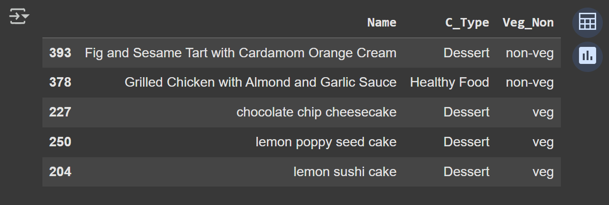
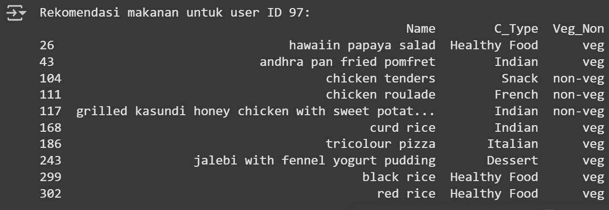

# Laporan Proyek Machine Learning - Aksamala Citrayuh Anasita
**Sistem Rekomendasi Makanan**

## Project Overview

Dalam era digital saat ini, konsumen menghadapi begitu banyak pilihan makanan dari berbagai restoran dan platform layanan pengantaran makanan. Hal ini menimbulkan tantangan dalam menemukan makanan yang sesuai dengan preferensi dan kebutuhan individu secara cepat dan efektif. Sistem rekomendasi makanan menjadi solusi penting untuk membantu pengguna dalam memilih makanan yang sesuai dengan selera, kebiasaan makan, dan kebutuhan nutrisi mereka.

Proyek ini bertujuan untuk mengembangkan sistem rekomendasi makanan menggunakan dataset Food Recommendation System dari Kaggle, yang berisi data terkait preferensi makanan, jenis hidangan, dan atribut lain yang relevan. Sistem ini diharapkan dapat meningkatkan pengalaman pengguna dalam memilih makanan dengan memberikan rekomendasi yang personal dan akurat. Selain itu, solusi ini dapat membantu pelaku bisnis kuliner meningkatkan loyalitas pelanggan melalui layanan yang lebih personal dan berbasis data.

Pentingnya penyelesaian masalah ini didukung oleh riset yang menunjukkan bahwa sistem rekomendasi memainkan peranan vital dalam berbagai bidang e-commerce dan layanan daring, termasuk makanan (Ricci et al., 2015). Studi juga menegaskan bahwa personalisasi melalui algoritma rekomendasi dapat meningkatkan tingkat kepuasan dan keterlibatan pengguna secara signifikan (Adomavicius & Tuzhilin, 2005). Oleh karena itu, penerapan metode machine learning dan analisis data yang tepat dalam konteks sistem rekomendasi makanan sangat penting untuk menghadirkan solusi yang efektif dan bermanfaat.

**Referensi:**
- [APA] (F. Ricci, L. Rokach, and B. Shapira, Recommender Systems Handbook, 2nd ed. Springer, 2015.)
- [APA] (G. Adomavicius and A. Tuzhilin, "Toward the next generation of recommender systems: A survey of the state-of-the-art and possible extensions," IEEE Transactions on Knowledge and Data Engineering, vol. 17, no. 6, pp. 734–749, Jun. 2005.)

## Business Understanding

Pada tahap ini, dilakukan klarifikasi dan pemahaman terhadap masalah bisnis yang ingin diselesaikan dengan menggunakan data sistem rekomendasi makanan. Tujuan utama adalah membantu pengguna menemukan makanan yang sesuai preferensi mereka berdasarkan rating dan deskripsi makanan yang tersedia.

### Problem Statements
1.	Pengguna sering kesulitan menemukan makanan yang sesuai dengan preferensi mereka di tengah banyaknya pilihan. Tanpa sistem rekomendasi, pengguna perlu mencoba satu per satu makanan secara manual, yang tidak efisien dan mengurangi pengalaman pengguna.
2.	Data interaksi pengguna dengan makanan, berupa rating, masih terbatas dan tidak merata, sehingga menyulitkan sistem dalam memberikan rekomendasi yang akurat, terutama untuk pengguna baru atau makanan yang belum banyak dinilai.

### Goals
1.	Membangun sistem rekomendasi makanan yang dapat memberikan rekomendasi makanan sesuai preferensi pengguna berdasarkan karakteristik makanan dan riwayat interaksi pengguna, sehingga pengguna lebih mudah menemukan makanan yang mereka sukai.    
2.	Meningkatkan kualitas dan cakupan rekomendasi dengan mengimplementasikan metode rekomendasi hybrid (content-based filtering dan collaborative filtering) agar mampu mengatasi keterbatasan data rating dan memberikan rekomendasi yang relevan untuk semua pengguna, termasuk pengguna baru.

    ### Solution statements
    Dalam mengembangkan sistem rekomendasi makanan, terdapat beberapa pendekatan yang dapat digunakan untuk menghasilkan rekomendasi yang efektif berdasarkan preferensi pengguna dan karakteristik item. Berikut adalah dua pendekatan utama yang dapat diterapkan: **Content-Based Filtering** dan **Collaborative Filtering**.    

    a. **Content-Based Filtering (Penyaringan Berbasis Konten)**
    
    Content-based filtering merekomendasikan item kepada pengguna berdasarkan fitur dari item itu sendiri. Pendekatan ini menganalisis atribut dari makanan (misalnya jenis masakan, kategori veg/non-veg, deskripsi bahan) untuk menemukan kesamaan antar item. Sistem merekomendasikan item yang mirip dengan yang telah disukai oleh pengguna sebelumnya.  

    **Langkah Implementasi:**
    - **Ekstraksi Fitur**: Gabungkan fitur relevan dari makanan seperti C_Type, Veg_Non, dan Describe menjadi satu string untuk setiap item.
    - **Vektorisasi**: Gunakan teknik seperti TF-IDF untuk mengubah data teks menjadi vektor numerik.
    - **Perhitungan Similaritas**: Hitung cosine similarity antar vektor TF-IDF untuk mengukur kemiripan item.
    - **Generasi Rekomendasi**: Untuk makanan tertentu, ambil N item teratas yang paling mirip berdasarkan skor similarity. 

    **Kelebihan:**
    - Rekomendasi yang dipersonalisasi berdasarkan preferensi sebelumnya.
    - Tidak memerlukan data interaksi pengguna yang banyak dan cocok untuk item baru.

    **Kekurangan:**
    - Terbatas pada merekomendasikan item yang mirip dengan item yang sudah pernah dikonsumsi pengguna.
    - Membutuhkan data deskripsi item yang lengkap.    

    b. **Collaborative Filtering (Penyaringan Kolaboratif)**
    Collaborative filtering merekomendasikan item berdasarkan preferensi pengguna lain yang memiliki kesamaan pola interaksi. Pendekatan ini memanfaatkan data rating pengguna terhadap item untuk mengidentifikasi pola dan kemiripan antar pengguna atau item. Terdapat dua tipe utama: user-based dan item-based collaborative filtering.    

    **Langkah Implementasi:**
    - **Persiapan Data**: Buat matriks user-item yang baris melambangkan pengguna dan kolom melambangkan makanan, dan nilainya adalah rating.
    - **Encoding**: Map User_ID dan Food_ID ke indeks numerik agar mudah diproses.
    - **Normalisasi**: Normalisasikan rating ke rentang yang sama (misal 0 sampai 1).
    - **Definisi Model**: Gunakan model neural network dengan embedding layer untuk mempelajari representasi pengguna dan item.
    - **Pelatihan Model**: Latih model dengan data interaksi untuk memprediksi rating makanan yang belum dirating oleh pengguna.
    - **Generasi Rekomendasi**: Prediksi rating untuk item yang belum dinilai dan rekomendasikan item dengan skor tertinggi.    

    **Kelebihan:**
    - Bisa merekomendasikan item yang tidak mirip dengan yang pernah dikonsumsi pengguna sehingga menghasilkan rekomendasi lebih bervariasi.
    - Belajar dari interaksi pengguna, sehingga akurasi rekomendasi meningkat seiring waktu.   

    **Kekurangan:** 
    - Memerlukan data interaksi pengguna yang cukup banyak agar efektif.
    - Mengalami masalah cold start pada pengguna atau item baru yang belum memiliki rating.  

## Data Understanding
Dataset yang digunakan dalam proyek ini adalah dataset sistem rekomendasi makanan yang diunduh dari Kaggle. Dataset ini berisi informasi mengenai berbagai jenis makanan dan rating yang diberikan oleh pengguna. Terdapat total 400 jenis makanan dan 512 rating yang diberikan oleh 101 pengguna. Dataset ini dapat diunduh dari tautan berikut: 
[Food Recommendation System Datase](https://www.kaggle.com/datasets/schemersays/food-recommendation-system)

**Variabel-variabel dalam Dataset**
1.	**Food_ID**: Merupakan identifikasi unik untuk setiap jenis makanan dalam dataset. Tipe data: integer.    
2.	**Name**: Nama dari makanan yang disajikan. Tipe data: string.    
3.	**C_Type**: Jenis masakan yang disajikan, seperti Healthy Food, Snack, Dessert, dan lain-lain. Tipe data: string.    
4.	**Veg_Non**: Kategori makanan, apakah makanan tersebut vegetarian (veg) atau non-vegetarian (non-veg). Tipe data: string.    
5.	**Describe**: Deskripsi atau bahan-bahan yang digunakan dalam makanan. Tipe data: string.    
6.	**User _ID**: Merupakan identifikasi unik untuk setiap pengguna yang memberikan rating. Tipe data: integer.    
7.	**Rating**: Nilai yang diberikan oleh pengguna untuk makanan tertentu, berkisar antara 1 hingga 10. Tipe data: float.    

**Exploratory Data Analysis (EDA)**
Untuk memahami data lebih dalam, beberapa tahapan EDA dilakukan, termasuk visualisasi data. Berikut adalah beberapa insight yang diperoleh dari analisis awal:  
1.	Distribusi Rating: Visualisasi distribusi rating menunjukkan bahwa sebagian besar rating yang diberikan cenderung berada di kisaran 4 hingga 6, dengan sedikit rating yang sangat rendah (1) atau sangat tinggi (10). Hal ini menunjukkan bahwa pengguna cenderung memberikan rating yang positif. 
2.	Distribusi Jenis Masakan (C_Type): Dari analisis jenis masakan, terlihat bahwa kategori Healthy Food dan Snack adalah yang paling banyak tersedia dalam dataset, sedangkan kategori lain seperti Korean dan Nepalese memiliki jumlah yang lebih sedikit. Hal ini dapat mempengaruhi rekomendasi yang diberikan kepada pengguna.    
3.	Distribusi Kategori Veg/Non-Veg: Analisis menunjukkan bahwa terdapat keseimbangan antara makanan vegetarian dan non-vegetarian, dengan sedikit lebih banyak makanan vegetarian. Ini penting untuk mempertimbangkan preferensi pengguna dalam rekomendasi.    

## Data Preparation
Pada tahap ini, dilakukan serangkaian teknik persiapan data (data preparation) yang bertujuan untuk memastikan kualitas dan konsistensi data sebelum digunakan dalam pembangunan model rekomendasi. Proses data preparation dilakukan secara berurutan sebagai berikut:    
1.	**Pemeriksaan Missing Values**
Dilakukan pengecekan nilai kosong pada dua dataset utama: `foods` dan `ratings`.
- Dataset `foods` tidak memiliki missing value.
- Dataset `ratings` memiliki satu baris dengan nilai NaN pada ketiga kolom (`User_ID`, `Food_ID`, `Rating`).

2.	**Menghapus Baris dengan Missing Values**
Baris yang mengandung nilai kosong dihapus dari dataset `ratings` untuk memastikan integritas data dan keakuratan model, khususnya dalam metode Collaborative Filtering yang sangat sensitif terhadap data yang tidak lengkap.

3.	**Pengubahan Tipe Data**
Untuk keperluan pemrosesan numerik dan encoding:
- Kolom `User_ID` dan `Food_ID` pada dataset `ratings` diubah dari float menjadi integer agar dapat diolah lebih efisien dan akurat, terutama untuk proses encoding.
- Kolom `Rating` tetap dalam tipe float untuk keperluan normalisasi ke skala 0-1.

4.	**Penghilangan Spasi pada Kategori**
Dilakukan penghapusan spasi di awal/akhir string pada kolom `C_Type` dan `Veg_Non` di dataset `foods` untuk menghindari nilai kategori ganda yang identik secara semantik namun berbeda secara sintaksis (misal: " Korean" vs "Korean").

5.	**Penggabungan Dataset**
Dataset `ratings` dan `foods` digabung berdasarkan `Food_ID` menggunakan metode left join, sehingga setiap data rating dilengkapi dengan atribut makanan terkait (nama, jenis masakan, kategori, dan deskripsi). Hal ini memudahkan proses eksplorasi dan pembangunan model rekomendasi berbasis konten.

6.	**Verifikasi Kembali Missing Values pada Gabungan Dataset**
Setelah penggabungan, dilakukan pengecekan ulang nilai kosong untuk memastikan proses penggabungan tidak menghasilkan missing value baru yang dapat mengganggu pemodelan.    

7. **Pembuatan Fitur Gabungan untuk TF-IDF (Content-Based Filtering)**
Dibuat fitur teks gabungan dari kolom `C_Type`, `Veg_Non`, dan `Describe` menjadi satu kolom `combined_features` untuk digunakan pada Content-Based Filtering.

8. **Vektorisasi TF-IDF**
Fitur gabungan tersebut diproses menggunakan `TfidfVectorizer` untuk menghasilkan matriks numerik berbasis bobot term frequency-inverse document frequency (TF-IDF) dari deskripsi makanan. Matriks ini digunakan untuk menghitung kemiripan antar makanan dengan cosine similarity.

9. **Encoding Kolom User_ID dan Food_ID (Collavorative Filtering)**
`User_ID` dan `Food_ID` di-encode ke dalam indeks integer menggunakan dictionary mapping. Kolom baru bernama `user` dan `food` ditambahkan ke dataset ratings untuk menyimpan hasil encoding.

10. **Normalisasi Nilai Rating**
Kolom `Rating` dinormalisasi ke skala [0, 1] menggunakan rumus min-max normalization. Hal ini penting karena model deep learning yang digunakan (Collaborative Filtering) lebih stabil jika target berada dalam rentang 0–1.

11. **Shuffling Data**
Sebelum membagi dataset menjadi data pelatihan dan validasi, dilakukan shuffling pada dataset `ratings` menggunakan `ratings = ratings.sample(frac=1, random_state=42).reset_index(drop=True)`. Teknik ini bertujuan untuk mengacak urutan data sehingga model tidak terpengaruh oleh urutan data yang mungkin memiliki pola tertentu.

12. **Pembagian Dataset (Data Splitting)**
Dataset `ratings` dibagi menjadi data pelatihan (80%) dan data validasi (20%) secara acak. Hal ini bertujuan untuk mengevaluasi performa model pada data yang tidak dilatih. Fitur input (`user`, `food`) dan target (`rating_norm`) dipisahkan untuk digunakan pada tahap pelatihan model Collaborative Filtering.

## Modeling
Pada tahapan ini dibangun dua pendekatan sistem rekomendasi berbeda untuk menyelesaikan permasalahan rekomendasi makanan, yaitu Content-Based Filtering dan Collaborative Filtering. Kedua model menghasilkan top-N rekomendasi makanan yang disesuaikan dengan preferensi pengguna berdasarkan konten makanan atau riwayat rating pengguna.

**1. Content-Based Filtering**
Model ini merekomendasikan makanan berdasarkan kemiripan konten dari makanan itu sendiri, bukan dari interaksi pengguna. Fitur yang digunakan mencakup jenis masakan `(C_Type)`, kategori makanan `(Veg_Non)`, dan deskripsi bahan makanan `(Describe)`.
**Langkah-langkah Modeling:**
1. Tiga fitur tekstual (`C_Type`, `Veg_Non`, dan `Describe`) digabungkan menjadi kolom baru bernama `combined_features`.
2. Representasi teks dari `combined_features` kemudian diproses menggunakan TF-IDF Vectorizer untuk membentuk matriks fitur.
3. Cosine similarity digunakan untuk menghitung kemiripan antar makanan.
4. Fungsi `recommend_food(nama_makanan, top_n=5)` mengembalikan daftar makanan yang paling mirip berdasarkan skor kemiripan tertinggi.

**Contoh Output:**
`recommend_food("christmas cake", top_n=5)`

**Kelebihan:**
- Dapat merekomendasikan makanan baru (*cold-start item*)
- Rekomendasi dapat dijelaskan melalui fitur makanan yang mirip.

**Kekurangan:**
- Tidak mempertimbangkan preferensi personal pengguna.
- Hanya merekomendasikan makanan yang serupa dengan input.

**2. Collaborative Filtering (Neural Network)**
Model ini memanfaatkan interaksi historis pengguna (dalam bentuk rating) untuk mempelajari preferensi pengguna. Pendekatan yang digunakan adalah neural collaborative filtering dengan embedding layer untuk pengguna dan makanan.
**Langkah-langkah Modeling:**
1. ID pengguna dan makanan di-encode menjadi indeks numerik.
2. Nilai rating dinormalisasi ke rentang [0, 1].
3. Dibangun model Neural Network sederhana:
- Dua embedding layer: satu untuk pengguna, satu untuk makanan.
- Operasi Dot Product dilakukan antara embedding pengguna dan makanan.
4. Model dilatih menggunakan Mean Squared Error (MSE) sebagai fungsi kerugian.
5. Setelah pelatihan, model digunakan untuk memprediksi rating makanan yang belum pernah dirating oleh pengguna tertentu.
6. Makanan dengan prediksi rating tertinggi direkomendasikan ke pengguna.

**Contoh Output dengan ID User 17:**

**Kelebihan:**
- Menangkap preferensi pengguna secara personal.
- Rekomendasi lebih relevan dan kontekstual bagi masing-masing pengguna.

**Kekurangan:**
- Tidak bekerja optimal untuk pengguna baru yang belum memiliki riwayat rating (*cold-start user*).
- Membutuhkan data interaksi dalam jumlah cukup banyak untuk menghasilkan rekomendasi yang akurat.

## Evaluation
Dalam proyek ini, saya menggunakan beberapa metrik evaluasi untuk menilai kinerja model rekomendasi yang dikembangkan, baik untuk Content-Based Filtering (CBF) maupun Collaborative Filtering (CF). Berikut adalah penjelasan mengenai metrik yang digunakan dan hasil evaluasi berdasarkan metrik tersebut.
**Metrik Evaluasi:**
1. **Precision@k**: Precision mengukur proporsi rekomendasi yang relevan di antara k rekomendasi teratas. Ini memberikan gambaran tentang seberapa banyak dari rekomendasi yang diberikan yang benar-benar sesuai dengan preferensi pengguna.
2. **Recall@k**: Recall mengukur proporsi item relevan yang berhasil direkomendasikan di antara semua item relevan yang ada. Ini menunjukkan seberapa baik model dalam menemukan item yang relevan.
3. **NDCG@k (Normalized Discounted Cumulative Gain)**: NDCG mengukur kualitas peringkat rekomendasi dengan mempertimbangkan posisi item relevan dalam daftar rekomendasi. Ini memberikan bobot lebih pada item relevan yang muncul lebih awal dalam daftar.
4. **Mean Squared Error (MSE) dan Root Mean Squared Error (RMSE)**: MSE mengukur rata-rata kuadrat selisih antara nilai yang diprediksi dan nilai aktual. RMSE adalah akar kuadrat dari MSE dan memberikan ukuran kesalahan dalam satuan yang sama dengan data asli.

**Hasil Proyek Berdasarkan Metrik Evaluasi:**
1. Evaluasi Content-Based Filtering:
- Precision@5: 0.2000
- Recall@5: 0.2000
- NDCG@5: 0.1312

Hasil ini menunjukkan bahwa dari 5 rekomendasi teratas, hanya 20% yang relevan dengan preferensi pengguna. Ini menunjukkan bahwa meskipun model dapat memberikan beberapa rekomendasi yang relevan, masih ada ruang untuk perbaikan dalam hal akurasi rekomendasi. NDCG yang rendah juga menunjukkan bahwa relevansi item relevan tidak muncul di posisi teratas dalam daftar rekomendasi.

2. Evaluasi Collaborative Filtering:
- Mean Squared Error (MSE): 0.2311313513726633
- Root Mean Squared Error (RMSE): 0.4807612207454583

**Kesimpulan:**
Proyek ini berhasil mengembangkan sistem rekomendasi makanan menggunakan dua pendekatan utama: Content-Based Filtering (CBF) dan Collaborative Filtering (CF). Evaluasi menunjukkan bahwa model CBF memiliki Precision@5 dan Recall@5 masing-masing sebesar 0.2000, menandakan bahwa hanya 20% dari rekomendasi teratas yang relevan, dengan NDCG@5 yang rendah (0.1312) menunjukkan perlunya perbaikan dalam akurasi rekomendasi. Sementara itu, model CF menunjukkan MSE sebesar 0.2311313513726633 dan RMSE sebesar 0.4807612207454583, menunjukkan kesalahan signifikan dalam prediksi rating. Meskipun CF dapat memberikan rekomendasi yang lebih personal, tantangan cold start untuk pengguna baru tetap ada. Oleh karena itu, penerapan metode hybrid yang menggabungkan kedua pendekatan dapat meningkatkan akurasi dan relevansi rekomendasi, serta mengatasi masalah cold start. Secara keseluruhan, sistem rekomendasi ini memiliki potensi besar untuk meningkatkan pengalaman pengguna dan membantu pelaku bisnis kuliner dalam memberikan layanan yang lebih personal dan berbasis data.